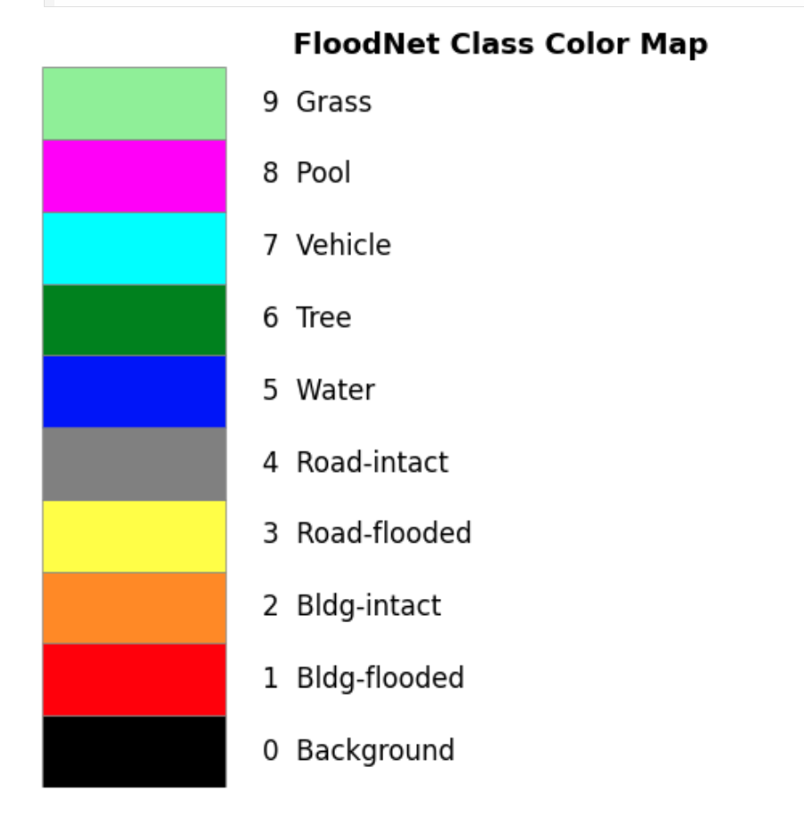
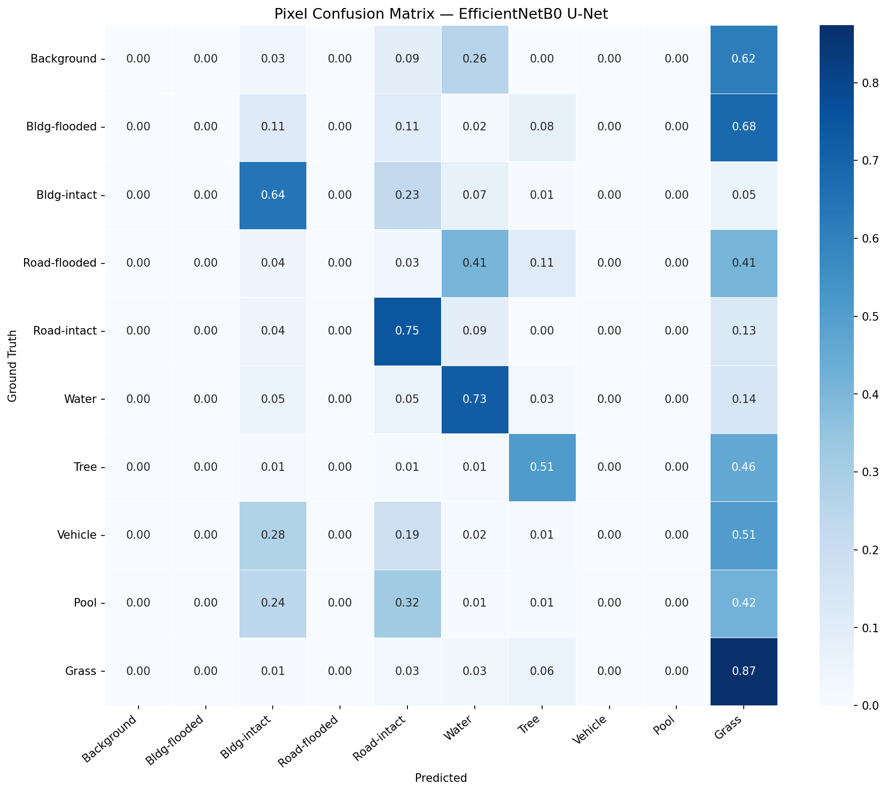
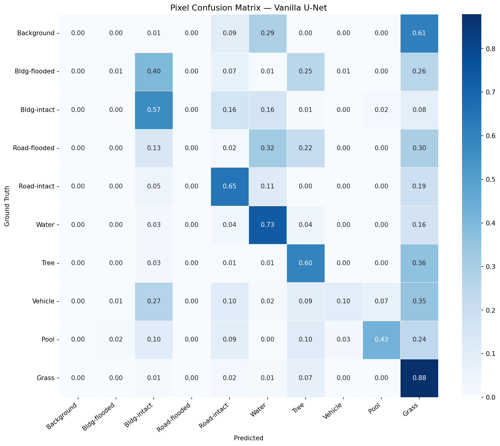
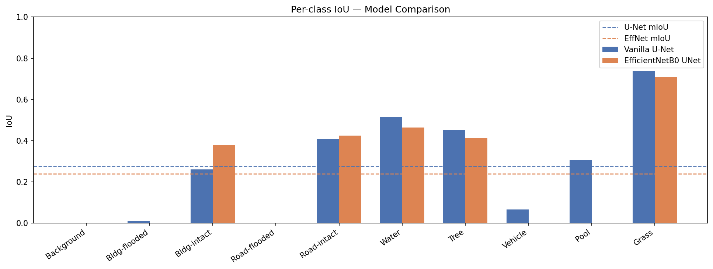

# FloodNet Semantic Segmentation Project

This repository contains a complete semantic segmentation pipeline built for the **FloodNet** aerial imagery dataset. The goal is to identify flooded vs non‑flooded objects (buildings, roads, water, vegetation, etc.) using U‑Net architectures in TensorFlow/Keras.

## Problem Description & Dataset

FloodNet is a publicly available challenge dataset consisting of high‑resolution aerial images annotated with **10 semantic classes** (background, flooded/non‑flooded buildings and roads, water, tree, vehicle, pool, grass). The dataset has approximately 398 labeled training pairs. The task is to build a model that performs pixel‑wise classification at **640×640 resolution** (minimum project requirement).

Key dataset details:

* **Track 1** – semantic segmentation
* 10 classes with a highly imbalanced distribution (vehicles and pools are very rare)
* Images are 3‑channel RGB JPGs; masks are PNGs with integer class IDs




For this project the data is downloaded using the `kagglehub` helper, stored under `~/.cache/kagglehub/...` and then split into train/validation/test sets (70/15/15).

## Setup Instructions

1. **Clone the repository** and navigate into it:
	```bash
	git clone https://github.com/Ledja22/mini-project-8.git
	cd mini-project-8
	```
2. **Install dependencies** (preferably in a virtual environment):
	```bash
	pip install -r requirements.txt
	# requirements include tensorflow, albumentations, kagglehub, opencv-python, matplotlib, seaborn, scikit-learn, etc.
	```
3. **Download the FloodNet dataset** by running the first cell in `notebook/notebook.ipynb` or manually via Kaggle credentials. The notebook uses `kagglehub.dataset_download(...)` to fetch the data automatically.
4. **Adjust paths** if necessary: the notebook assumes the dataset lives in `~/.cache/kagglehub/...`; update `DATA_DIR` at the top of the notebook if your environment differs.

## Running the Code

All code is contained in `notebook/notebook.ipynb`. The high‑level workflow is:

1. **Setup & imports** – install packages and configure TensorFlow.
2. **Data exploration & pipeline** – list files, verify image/mask pairs, perform 70/15/15 splits, apply synchronized Albumentations augmentations, and build `tf.data` pipelines.
3. **Model architectures** – define two U‑Net variants:
	* Vanilla U‑Net built from scratch
	* U‑Net with an EfficientNetB0 encoder pretrained on ImageNet (two‑phase training)
4. **Training** – compile and train both models with custom loss functions (Dice, cross‑entropy, or combination) and useful callbacks (EarlyStopping, ReduceLROnPlateau, ModelCheckpoint, TensorBoard).
5. **Evaluation** – run the test set through both models, compute per‑class IoU/Dice, confusion matrices, and save plots.
6. **Visualization** – display six example predictions (top 3 good, bottom 3 poor) with error maps.

To run end‑to‑end, simply execute the notebook cells in order.

## Results Summary

After training on the provided split (640×640, batch size 4, 25 epochs), the following metrics were obtained on the held‑out test sets.

📊 Summary Table:

| Class               | U‑Net IoU | EffNet IoU | U‑Net Dice | EffNet Dice |
|---------------------|-----------|------------|------------|-------------|
| Background          | 0.0000    | 0.0000     | 0.0000     | 0.0000      |
| Bldg-flooded        | 0.0083    | 0.0000     | 0.0165     | 0.0000      |
| Bldg-intact         | 0.2599    | 0.3775     | 0.4126     | 0.5481      |
| Road-flooded        | 0.0000    | 0.0000     | 0.0000     | 0.0000      |
| Road-intact         | 0.4088    | 0.4247     | 0.5804     | 0.5962      |
| Water               | 0.5141    | 0.4636     | 0.6791     | 0.6335      |
| Tree                | 0.4508    | 0.4122     | 0.6215     | 0.5838      |
| Vehicle             | 0.0658    | 0.0000     | 0.1235     | 0.0000      |
| Pool                | 0.3046    | 0.0000     | 0.4669     | 0.0000      |
| Grass               | 0.7370    | 0.7100     | 0.8486     | 0.8304      |

### Effnet matrix 


### U-net matrix


#### U-Net   mIoU=0.2749  mean Dice=0.3749
#### EffNet  mIoU=0.2388  mean Dice=0.3192



## Sample Prediction Visualizations

The notebook also produces a grid of six test images showing:

1. Input image
2. Ground truth mask (color coded)
3. Model prediction mask
4. Error map (grey = correct, red = incorrect)

Three “good” and three “poor” examples are selected based on per‑image mIoU, providing insight into model strengths and weaknesses. The output is saved as `predictions_visualization.png`.

#### Best and Worst results 


## Team Member Contributions

* Ledja Halltari – dataset handling, data pipeline, augmentation strategy, evaluation metrics
* Ledja Halltari – model architecture design (vanilla U‑Net, EfficientNet backbone), training and hyperparameter tuning
* Ledja Halltari– visualization code, notebook formatting, README documentation, result analysis
* Nicky Cheng & Ledja Halltari- Report and analysis


## Results and Analysis

The model performed best on large, visually consistent classes and struggled on small or semantically ambiguous ones. The easiest class to segment was Grass (IoU 0.7370), followed by Water (0.5141) and Tree (0.4508), likely because these categories form large, homogeneous regions with distinctive textures in aerial imagery. In contrast, the hardest classes were Road-flooded (0.0000), Background (0.0000), Bldg-flooded (0.0083), and Vehicle (0.0658). These classes either appear in very small regions (e.g., vehicles) or require distinguishing subtle contextual differences, such as separating flooded vs. intact structures. Error analysis shows that mistakes concentrate primarily around object boundaries and thin structures like roads, indicating the model learns coarse semantic regions well but struggles with precise localization. In more complex scenes, some errors extend into interior regions, suggesting the model also has difficulty distinguishing visually similar classes such as flooded roads, water, and grass.

Image resolution had a measurable impact on performance. Training at 640×640 achieved an mIoU of 0.2749, compared to 0.2617 at 256×256, indicating that higher resolution preserves spatial detail important for identifying narrow roads, small objects, and flood boundaries. Lower resolutions remove fine structures and increase class confusion. The best-performing setup used a combined Dice + Cross-Entropy loss, which works well for segmentation problems with strong class imbalance because Dice emphasizes region overlap while cross-entropy stabilizes pixel-wise classification. Overall, the results show that while the model can segment large, consistent regions effectively, it struggles with rare classes, small objects, and subtle distinctions between flooded and non-flooded infrastructure.